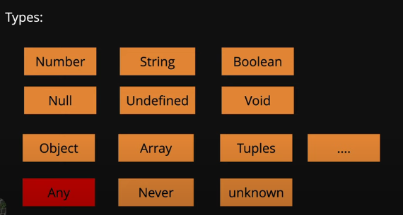

- Ts analyze the code as we type , it gives hint in IDE (ie.., it statically checks the code)
- its like a development tool, your project still runs js , it helps to write better scalable maintainable & error free code

## Types in TypeScript
 - 